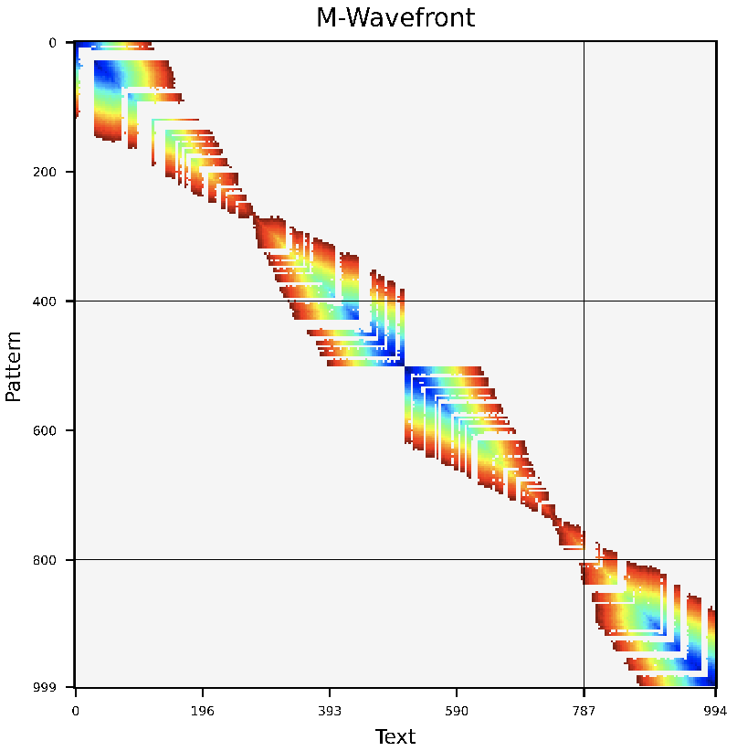
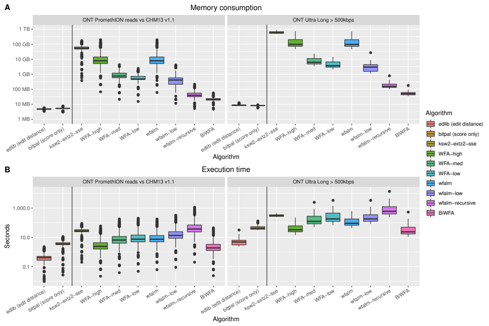

# Bidirectional WFA

### 1. WHAT IS BIDIRECTIONAL WFA (BiWFA)?

The bidirectional WFA (BiWFA) algorithm is the first gap-affine algorithm capable of computing optimal alignments in `O(s)` memory while retaining the WFA's time complexity of `O(ns)`.
The core idea of the BiWFA algorithm is to perform the WFA algorithm simultaneously in both directions on the strings: from start to end, and from end to start.
Each direction will only retain `max{x,o+e}` wavefronts in memory.
This is insufficient to perform a full traceback.
However, when they "meet" in the middle, we can infer a breakpoint in the alignment that divides the optimal score roughly in half.
Then, we can then apply the same procedure on the two sides of the breakpoint recursively.
In practice, our implementation never requires more than a few hundred MBs aligning noisy Oxford Nanopore Technologies reads up to 1 Mbp long while maintaining competitive execution times.

<p align = "center">

</p>


For more documentation on the library and other features, go to [WFA2-lib](https://github.com/smarco/WFA2-lib).

- **A note for the fierce competitors.** I can understand that science and publishing have become a fierce competition these days. Many researchers want their methods to be successful and popular, seeking funding, tenure, or even fame. If you are going to benchmark the WFA using the least favourable configuration, careless programming, and a disadvantageous setup, please, go ahead. But remember, researchers like you have put a lot of effort into developing the WFA. We all joined this "competition" because we sought to find better methods that could truly help other researchers. So, try to be nice, tone down the marketing, and produce fair evaluations and honest publications. 


- We develop methods to help the community and push science forward. If you like the BiWFA ideas and would like to use it, feel free to copy, improve, and even reach out and request more features. In return, we just ask for proper acknowledgement, citation, or comment on where the methods and ideas came from.

### 1.1 Getting started

The up-to-date version of BiWFA is provided in the [WFA2-lib](https://github.com/smarco/WFA2-lib) repository (the memory mode `ultralow` uses the BiWFA algorithm).
Therefore, git clone and compile the library, tools, and examples:

```
git clone https://github.com/smarco/WFA2-lib
cd WFA2-lib
make clean all
```

### 1.2 Alignment Testing & Benchmarking

The BiWFA-paper includes the benchmarking tool *align-benchmark* to test the BiWFA.
This tool takes as input a dataset containing pairs of sequences (i.e., pattern and text) to align.
Patterns are preceded by the '>' symbol and texts by the '<' symbol.
Example:

```
>ATTGGAAAATAGGATTGGGGTTTGTTTATATTTGGGTTGAGGGATGTCCCACCTTCGTCGTCCTTACGTTTCCGGAAGGGAGTGGTTAGCTCGAAGCCCA
<GATTGGAAAATAGGATGGGGTTTGTTTATATTTGGGTTGAGGGATGTCCCACCTTGTCGTCCTTACGTTTCCGGAAGGGAGTGGTTGCTCGAAGCCCA
>CCGTAGAGTTAGACACTCGACCGTGGTGAATCCGCGACCACCGCTTTGACGGGCGCTCTACGGTATCCCGCGATTTGTGTACGTGAAGCAGTGATTAAAC
<CCTAGAGTTAGACACTCGACCGTGGTGAATCCGCGATCTACCGCTTTGACGGGCGCTCTACGGTATCCCGCGATTTGTGTACGTGAAGCGAGTGATTAAAC
[...]
```

Once you have the dataset ready, you can run the *align-benchmark* tool to benchmark the performance.
Remember to specify `--wfa-memory-mode ultralow` to use the BiWFA algorithm.

```
$> ./bin/align_benchmark -i sample.dataset.seq ---wfa-memory-mode ultralow
...processed 10000 reads (benchmark=125804.398 reads/s;alignment=188049.469 reads/s)
...processed 20000 reads (benchmark=117722.406 reads/s;alignment=180925.031 reads/s)
[...]
...processed 5000000 reads (benchmark=113844.039 reads/s;alignment=177325.281 reads/s)
[Benchmark]
=> Total.reads            5000000
=> Time.Benchmark        43.92 s  (    1   call,  43.92  s/call {min43.92s,Max43.92s})
  => Time.Alignment      28.20 s  ( 64.20 %) (    5 Mcalls,   5.64 us/call {min438ns,Max47.05ms})
```

The *align-benchmark* tool will finish and report overall benchmark time (including reading the input, setup, checking, etc.) and the time taken by the algorithm (i.e., *Time.Alignment*).
If you want to measure the accuracy of the alignment method, you can add the option `--check` and all the alignments will be verified. 

```
$> ./bin/align_benchmark -i sample.dataset.seq --wfa-bidirectional --check
...processed 10000 reads (benchmark=14596.232 reads/s;alignment=201373.984 reads/s)
...processed 20000 reads (benchmark=13807.268 reads/s;alignment=194224.922 reads/s)
[...]
...processed 5000000 reads (benchmark=10625.568 reads/s;alignment=131371.703 reads/s)
[Benchmark]
=> Total.reads            5000000
=> Time.Benchmark         7.84 m  (    1   call, 470.56  s/call {min470.56s,Max470.56s})
  => Time.Alignment      28.06 s  (  5.9 %) (    5 Mcalls,   5.61 us/call {min424ns,Max73.61ms})
[Accuracy]
 => Alignments.Correct        5.00 Malg        (100.00 %) (samples=5M{mean1.00,min1.00,Max1.00,Var0.00,StdDev0.00)}
 => Score.Correct             5.00 Malg        (100.00 %) (samples=5M{mean1.00,min1.00,Max1.00,Var0.00,StdDev0.00)}
   => Score.Total           147.01 Mscore uds.            (samples=5M{mean29.40,min0.00,Max40.00,Var37.00,StdDev6.00)}
     => Score.Diff            0.00 score uds.  (  0.00 %) (samples=0,--n/a--)}
 => CIGAR.Correct             0.00 alg         (  0.00 %) (samples=0,--n/a--)}
   => CIGAR.Matches         484.76 Mbases      ( 96.95 %) (samples=484M{mean1.00,min1.00,Max1.00,Var0.00,StdDev0.00)}
   => CIGAR.Mismatches        7.77 Mbases      (  1.55 %) (samples=7M{mean1.00,min1.00,Max1.00,Var0.00,StdDev0.00)}
   => CIGAR.Insertions        7.47 Mbases      (  1.49 %) (samples=7M{mean1.00,min1.00,Max1.00,Var0.00,StdDev0.00)}
   => CIGAR.Deletions         7.47 Mbases      (  1.49 %) (samples=7M{mean1.00,min1.00,Max1.00,Var0.00,StdDev0.00)}
```

Using the `--check` option, the tool will report *Alignments.Correct* (i.e., total alignments that are correct, not necessarily optimal), and *Score.Correct* (i.e., total alignments that have the optimal score).
Note that the overall benchmark time will increase due to the overhead introduced by the checking routine, however the *Time.Alignment* should remain the same.

<p align = "center">

</p>

## 2. REPORTING BUGS AND FEATURE REQUEST

Feedback and bug reporting is highly appreciated. Please report any issue or suggestion on github or email to the main developer (santiagomsola@gmail.com).

## 3. LICENSE

BiWFA is distributed under MIT licence.

## 4. CITATION

**Santiago Marco-Sola, Jordan M Eizenga, Andrea Guarracino, Benedict Paten, Erik Garrison, Miquel Moreto**. Optimal gap-affine alignment in O(s) space.  _bioRxiv_  (2022). DOI [2022.04.14.488380](https://doi.org/10.1101/2022.04.14.488380)


